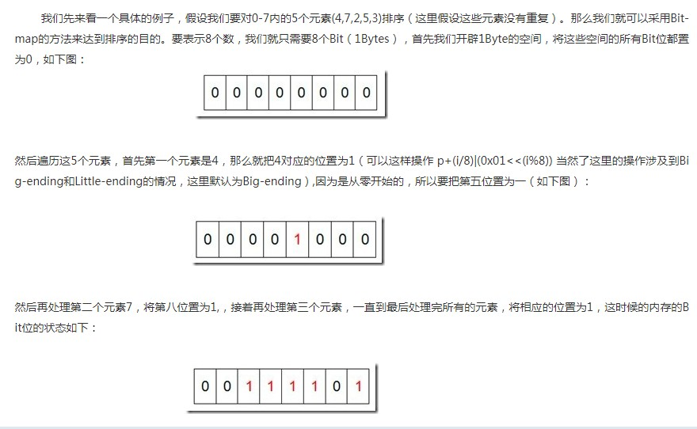
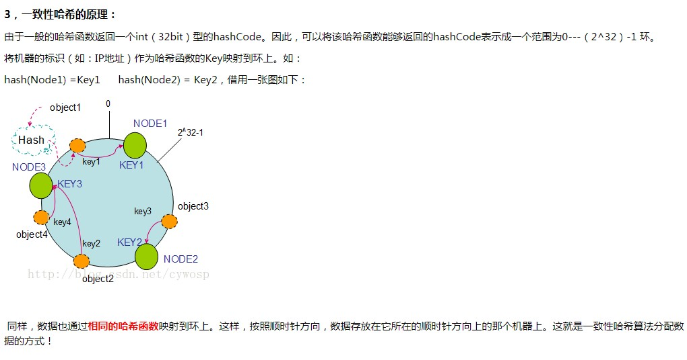

[TOC]

### BitMap算法
例：如何计算数据流中不同元素的个数，即类似于`count(distinct(KEY))`
1.HashSet  
最简单的方法是用`HashSet`，因为`HashSet`的Key是唯一的，所以来一个元素就往里面add，最后统计size即得到结果。但是如果是数据流非常大，如用户的UV（独立访客），而HashSet存储的是数据本身，占用空间非常大，如2亿条数据，那么HashSet存储2亿个String类型的Key可能会让内存爆表。
2.BitMap
BitMap用于处理大量数据排序相当节省空间，其原理类似于基数排序。
将值对应于Bit数组的某个位置1表示该位数存在。
对于以上问题可将元素整数化（利用Hash值或其它值来表示元素本身）。那么问题可化解为开辟长度为N的bit数组。假设来了一个元素vistor01，元素整形化后为657，那就将bit数组中（从低到高位数）第657位上的bit置为1，计算bit数组中1的个数即是结果。
关于BitMap，常用于排序

由于语言中不存在bit这种数组，因此可用int32位的数组来表示bit数据。那么bit-map十进制到二进制映射步骤如下
1.确定数组长度
假设bit数组长度为N，则int数组长度为int[1 + N / 32]来表示，则bit数组第M位在a[M/32]中的32中的某一位bit：
a[0] ----> 0-31
a[1] ----> 32-63
a[2] ----> 64-95
......

2.先确定bit数组的第M位在哪个区间，即int数组中的哪个索引下
如，确定第76位bit的位置
76 / 32 = 2，即在a[2]中

3.第2步已确定了在a[2]中，但是a[2]是一个32位的int，那么76位bit在32位中的具体哪一位呢？
76 % 32 = 76 - 2 * 32 = 12 即a[2]右起第12位即是要找的位置

4.返过来通过a[i]的值来找哪些位数是1呢？将a[i]值二进制化，找出1即可。

```C
/**
 * 设置所在的bit位为1
 *
 * T = O(1)
 *
 */
void set(int n, int *arr)
{
    int index_loc, bit_loc;

    index_loc = n >> SHIFT; // 等价于n / 32
    bit_loc = n & MASK;    // 等价于n % 32 。 h%2^n = h & (2^n -1)
    //求位数或运算
    arr[index_loc] |= 1 << bit_loc;
}

/**
 * 测试n所在的bit位是否为1
 *
 * T = O(1)
 *
 */
int test(int n, int *arr)
{
    int i, flag, index_loc, bit_loc;
    index_loc = n >> SHIFT; // 等价于n / 32
    bit_loc = n & MASK;    // 等价于n % 32 。 h%2^n = h & (2^n -1)
    i = 1 << (bit_loc);  //第bit_loc位为1，基于为0
    flag = arr[index_loc] & i;
    return flag;
}
```

> 给40亿个不重复的unsigned int的整数，没排过序的，然后再给一个数，如何快速判断这个数是否在那40亿个数当中？

```JAVA
int[] a = int[4000000/32 + 1]
//读取40个数，然后将对应的bit位置set 1

void set(int n, int[] arr) {
    int index_loc = n / 32;
    int bit_in_arr_loc = n % 32;
    int i = 1 << bit_in_arr_loc;
    arr[index_loc] = arr[index_loc] | i;
}

// 1表示存在  0表示不存在x
int find(int x, int[] arr) {
    int index_arr_x = x / 32;
    int bit_in_arr_loc_x = x % 32;
    // 判断arr[index_arr_x]中的第bit_in_arr_loc_x是否为1
    int compare = 1 << bit_in_arr_loc_x;
    return compare & a[index_arr_x];
}
```


### 令牌桶算法
> 如何设计API限流，如限制1min内请求次数不能超过100次

令牌桶算法是的思想是给每个用户`userId`分配一个Bucket存放token，这个Bucket可以存放在Redis缓存中，Bucket初始化一定数量N的token的，并以一定的速率1/r向其中push token，然后记录当前请求的时间，用户每请求一次就出一个token，并综合上次请求的时间差来、token push速率、bucket中剩余的token计算本次请求之后bucket中token的数量；如果获取token（bucket取出token）的速率比存入token的速率还快，那说明API请求速率已经超过最大限制，bucket为空时则获取token，即请求API失败。

### 一致Hash算法
用于解决负载均衡问题

> 一般负载均衡用Hash算法，将不同请求的客户端分布于不同的服务主机，但有一个问题是如果其中一台主机宕机了或者整个集群中添加了一台主机，那么所有的客户端分布将重新Hash一次，重新分布，大多数请求会转向其它服务器，这样可能会由于数据丢失变更而发生大量的访问错误。
如果服务器是缓存（如Redis服务器），那么由于Hash重新分布导致之前所有的缓存失效，大量的请求直接访问后台服务器（如DB数据库）等，这将导致灾难。

一致性Hash算法则可减小影响，将影响缩小到最小范围。其大致原理是将客户访问、分布式服务主机都Hash到一个环上，客户主机沿顺时针旋转，最近的服务主机为这些客户提供服务。



### trie树（字典树、前缀树）
每条路径代表一个字符串  
1.root不存储字符，每个节点存储一个字符;  
2.添加一个字符串时，遍历这个字符串，如果有，则继续下一个字符，然后下一个，如果没有，则添加这个字符；
3.搜索时一个一个字符找，找到对应的路径；  
4.前缀搜索，即输出匹配到最后一个节点的子节点  
5.每个节点可以存储对应的词频，然后用heap统计Top K  
6.查询效率，O(m)，m为字符串的长度